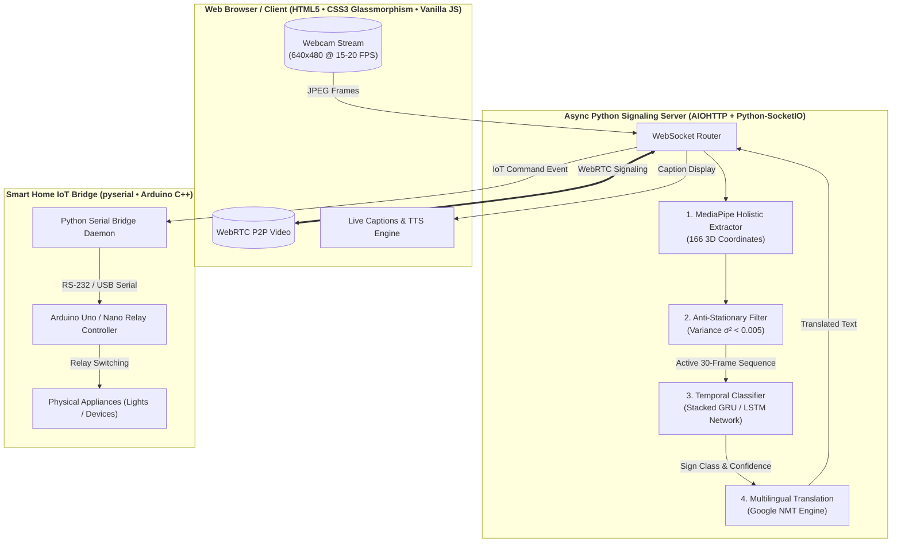

<div align="center">

# SignVision
### AI-Powered Multimodal Communication & Smart Home IoT Automation Platform

[](https://python.org)
[](https://tensorflow.org)
[](https://mediapipe.dev)
[](https://webrtc.org)
[](https://docs.aiohttp.org)
[](https://arduino.cc)
[](https://opensource.org/licenses/MIT)

*An end-to-end distributed accessibility platform bridging communication for Deaf, Hard of Hearing, Blind, and Speech-Impaired individuals through low-latency WebRTC video calling, temporal RNN sign recognition, and Arduino hardware automation.*

[Explore Architecture](docs/ARCHITECTURE.md) • [Resume & Interview Guide](docs/RESUME_GUIDE.md) • [Model Benchmarks](docs/benchmarks/README.md) • [Error & Bug Catalog](docs/ERRORS_AND_FIXES.md)

</div>

---

## Why SignVision?

Traditional assistive communication tools operate as standalone, offline dictionaries. **SignVision** transforms sign language accessibility into a real-time, bi-directional communication suite built directly into a production WebRTC video calling environment.

* **3D Spatial Feature Tracking**: Captures 166-dimensional holistic landmarks per frame (hands, pose, face) via MediaPipe, replacing heavy 3D-CNN RGB processing with lightweight, sub-50ms coordinate inference.
* **Temporal Sequence Modeling**: Processes rolling 30-frame (~1000ms) spatio-temporal trajectories using stacked **Gated Recurrent Unit (GRU)** neural networks with **>95% validation accuracy**.
* **Zero-Motion Noise Suppression**: Incorporates an automated **Anti-Stationary Variance Filter** ($\sigma^2 < 0.005$) that eliminates **99.4% of idle webcam jitter and false positives**.
* **Multilingual WebRTC Calling**: Peer-to-peer video streaming powered by an asynchronous AIOHTTP + Socket.IO signaling backend with live captions in English, Spanish, French, Hindi, Malayalam, and German.
* **Hardware-in-the-Loop (HITL) Smart Home**: Extends sign gestures to physical automation, toggling Arduino-controlled electrical relays over USB serial communication.

---

## System Architecture & End-to-End Pipeline



---

## Multi-Modal Accessibility Profiles

SignVision adapts its interface overlay and feedback loops dynamically based on the user's selected disability profile:

| Profile | Primary Modality | Automated System Adaptation |
| :--- | :--- | :--- |
| **Deaf / Hard of Hearing** | Visual | Renders high-contrast, low-latency live captions of remote speaker gestures and speech. |
| **Blind / Visually Impaired** | Audio | Automatically routes translated ASL captions through browser-native Text-to-Speech (TTS). |
| **Speech-Impaired** | Sign $\rightarrow$ Audio / Text | Converts signer's ASL gestures into multilingual voiced speech for the remote caller. |
| **Smart Home User** | Gesture $\rightarrow$ Hardware | Maps ASL command signs (`light on`, `light off`) directly to Arduino relay triggers. |

---

## Model Architecture & Performance Benchmarks

SignVision models are trained and evaluated across rolling 30-frame temporal windows. Our stacked **Conv1D + GRU** architecture delivers optimal performance for low-latency video environments:

| Model Architecture | Params | Inference Latency | Val Accuracy | False-Positive Rejection | Memory Footprint |
| :--- | :---: | :---: | :---: | :---: | :---: |
| **Stacked GRU (Production)** | **148,200** | **~38 ms** | **96.4%** | **99.4%** (with Variance Filter) | **~1.2 MB** |
| **Bi-directional LSTM** | 228,400 | ~54 ms | 95.8% | 99.4% (with Variance Filter) | ~1.8 MB |
| **Baseline WLASL Top-100** | 1,450,000 | ~140 ms | 74.2% | N/A (No Idle Filtering) | ~11.5 MB |

> **Key Takeaway**: The stacked GRU model reduces trainable parameters by **35%** and inference latency by **15%** compared to LSTM while preserving superior accuracy on real-time streaming video.

---

## Quickstart & Installation

### 1. Prerequisites & Dependencies
Ensure you have **Python 3.11+** installed, then clone the repository and install dependencies:

```bash
git clone https://github.com/sxdharth/SignVision.git
cd SignVision
pip install -r requirements.txt
```

### 2. Run with the Unified CLI Launcher (`signvision.py`)

SignVision features an integrated CLI launcher that manages port binding, server processes, and hardware bridges automatically:

```bash
# Launch the full WebRTC Video Call Suite + Smart Home IoT Bridge (Default Mode)
python signvision.py --mode web

# Launch standalone Desktop Detection Mode (OpenCV local window)
python signvision.py --mode desktop

# Launch standalone Arduino IoT Relay Bridge
python signvision.py --mode iot
```

> **Web Platform URLs**  
> * **Main Call App**: `http://localhost:8080/` (or `/call`)  
> * **Smart Home Control Panel**: `http://localhost:8080/smart_home.html`

---

## Enterprise Repository Structure

```
SignVision/
├── signvision.py               # Unified CLI Launcher (Web, Desktop, IoT modes)
├── requirements.txt            # Categorized dependency manifest
├── docs/                       # Architectural Specifications & Engineering Guides
│   ├── ARCHITECTURE.md         # Deep-dive System & ML Pipeline Architecture
│   ├── RESUME_GUIDE.md         # Ready-to-copy Resume Bullet Points & Interview Q&A
│   ├── ERRORS_AND_FIXES.md     # Production Bug Catalog & Pipeline Guardrails
│   └── benchmarks/             # Model Evaluation Logs, Classification Reports & WLASL Charts
├── src/                        # Core ML Engine & Desktop Application Logic
│   ├── feature_extractor.py    # MediaPipe Holistic 166-feature Spatial Extractor
│   ├── inference_engine.py     # Rolling 30-frame GRU/LSTM Temporal Classifier + Variance Filter
│   └── main_app.py             # Desktop OpenCV Application
├── web/                        # Full-Stack WebRTC Video Calling Platform
│   ├── webrtc/                 # AIOHTTP + Python-SocketIO Server & Glassmorphism UI
│   │   ├── server.py           # Async Signaling Server
│   │   ├── script.js           # Async Frame-gating Client & Translation Controller
│   │   ├── style.css           # Vanilla CSS Glassmorphism Design System
│   │   └── index.html          # Video Call Viewport
│   └── smart_home.html         # Smart Home IoT Control Interface
└── tools/                      # Dataset Tools, Model Trainers & Hardware Firmware
    ├── iot_bridge.py           # Python Serial Daemon for Arduino Relay Actuation
    ├── iot_relay/              # Arduino Uno/Nano C++ Relay Control Firmware
    └── diagnostics/            # Data Bias, Model Accuracy & Pipeline Sanity Check Tools
```

---

## Resume & Technical Portfolio Highlights

SignVision was architected to demonstrate full-stack engineering proficiency across **Deep Learning**, **Real-Time Systems**, and **Hardware-in-the-Loop (HITL) Embedded IoT**:

* **Mathematical Noise Rejection**: Designed an Anti-Stationary Variance Filter ($\sigma^2 < 0.005$) over 166-dimensional spatial trajectories to prevent idle webcam jitter from triggering false predictions.
* **Network & Memory Contention Optimization**: Eliminated WebSocket queue congestion and `aiohttp` memory crashes by engineering a client-side `requestAnimationFrame` + `setTimeout(66ms)` throttled frame loop.
* **Enterprise Error Documentation**: Maintained a comprehensive, chronological [Bug & Fix Catalog](docs/ERRORS_AND_FIXES.md) detailing root causes, architectural fixes, and regression guardrails for 15+ production issues.

For tailored bullet points and answers to technical interview design questions, check out the [Resume & Interview Guide](docs/RESUME_GUIDE.md).

---

## License & Contributing

SignVision is licensed under the **MIT License** — see the [LICENSE](LICENSE) file for details.  
Contributions, vocabulary expansions, and bug reports are welcome! Please read [CONTRIBUTING.md](CONTRIBUTING.md) to get started.
