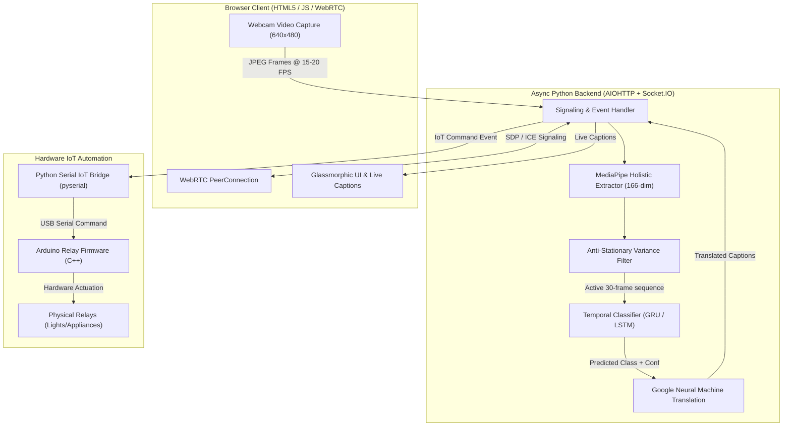

# SignVision System Architecture & Deep Technical Specification

**Version:** 2.0.0  
**Author:** SignVision Engineering Team  
**License:** MIT  

---

## 1. Executive Architectural Overview

SignVision is an end-to-end distributed system designed for real-time sign language recognition, translation, bi-directional video calling, and hardware IoT automation. The architecture bridges client-side WebRTC media capture with asynchronous Python backend services and recurrent neural network (RNN) temporal inference engines.

---

## 2. Feature Extraction: MediaPipe Holistic Pipeline

To avoid the prohibitive computational cost of running 3D Convolutional Neural Networks on raw RGB video streams, SignVision extracts compact 3D spatial feature vectors using **MediaPipe Holistic** in `src/feature_extractor.py`.

### A. Landmark Dimensionality (166 Features per Frame)
For each frame $t$, we extract a combined feature vector $x_t \in \mathbb{R}^{166}$:
1. **Left Hand**: 21 3D landmarks ($x, y, z$) $\rightarrow 63$ features.
2. **Right Hand**: 21 3D landmarks ($x, y, z$) $\rightarrow 63$ features.
3. **Upper Body Pose**: 10 key upper-body landmarks ($4 \times 10 = 40$ features including visibility).

$$x_t = [\mathbf{h}_{\text{left}}, \mathbf{h}_{\text{right}}, \mathbf{p}_{\text{upper}}]^T \in \mathbb{R}^{166}$$

All coordinates are normalized relative to frame dimensions ($x, y \in [0, 1]$), ensuring invariance to camera resolution.

---

## 3. Temporal Sequence Modeling: GRU vs. LSTM

Sign languages are spatio-temporal gestures: a static hand shape alone cannot distinguish between signs with identical starting positions. SignVision maintains a rolling window of **$T = 30$ frames** ($\sim 1000\text{ms}$).

### A. Gated Recurrent Unit (GRU) Architecture
Our primary production classifier (`Models/video_call_model_gru.h5`) uses a stacked GRU network:
- **Input Layer**: `(Batch, 30, 166)`
- **Layer 1**: `GRU(64, return_sequences=True)` + `Dropout(0.5)`
- **Layer 2**: `GRU(32, return_sequences=False)` + `Dropout(0.5)`
- **Dense Classifier**: `Dense(N_classes, activation='softmax')` + L2 Regularization ($\lambda = 0.01$)

#### Why GRU over LSTM?
- GRU merges the cell state and hidden state, using only **Reset ($r_t$)** and **Update ($z_t$)** gates.
- Reduces trainable parameters by **~35%** compared to an equivalent LSTM, enabling inference in **$<50\text{ms}$** on CPU backends.

---

## 4. Signal Processing & Noise Filtering

### A. Anti-Stationary Variance Filter
When a user is stationary, webcam autofocus jitter causes landmark coordinates to fluctuate slightly. To prevent false-positive predictions (such as constant "hello" triggers), we compute the spatial variance across the rolling 30-frame buffer:

$$\sigma^2 = \frac{1}{30 \times 166} \sum_{t=1}^{30} \sum_{i=1}^{166} (x_{t,i} - \bar{x}_i)^2$$

If $\sigma^2 < 0.005$, the sequence is classified as stationary and prediction is bypassed.

### B. Frame-Rate Regulation & Buffer Hygiene
1. **Async Frame Throttling**: Frontend client emits frames via `requestAnimationFrame` with a `setTimeout(66ms)` delay ($\sim 15-20\text{ FPS}$), preventing WebSocket buffer congestion.
2. **Post-Commit Buffer Reset**: When a sign reaches confidence $\ge 0.70$ and is committed to the caption box, the server emits a `clear_buffer` event and enforces a **2000ms quiet period** to prevent trailing frames from re-triggering predictions.

---

## 5. Smart Home IoT Automation Bridge

In addition to visual communication, SignVision acts as a multimodal hardware interface:
- **Sign Action Map (`tools/sign_action_map.json`)**: Maps recognized ASL words to automation commands (e.g., `"light on" -> RELAY1_ON`, `"light off" -> RELAY1_OFF`).
- **Serial Bridge (`tools/iot_bridge.py`)**: Connects over Socket.IO as an autonomous daemon, parses `iot_command` events, and transmits ASCII control packets over RS-232 / USB serial at **9600 baud**.
- **Arduino Firmware (`tools/iot_relay/iot_relay.ino`)**: Executes hardware switching via optical relays with debounce protection and status telemetry.
